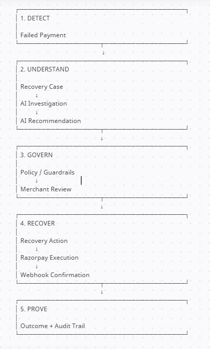
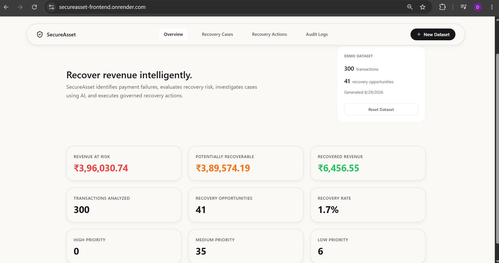
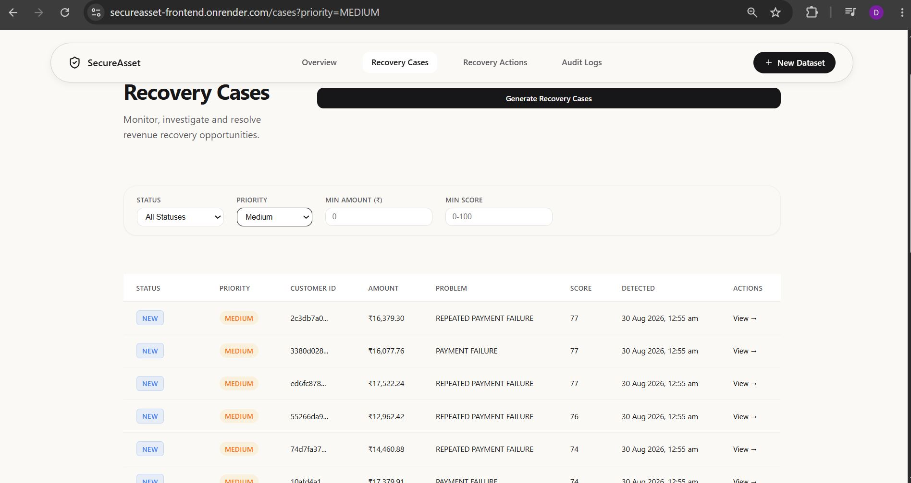
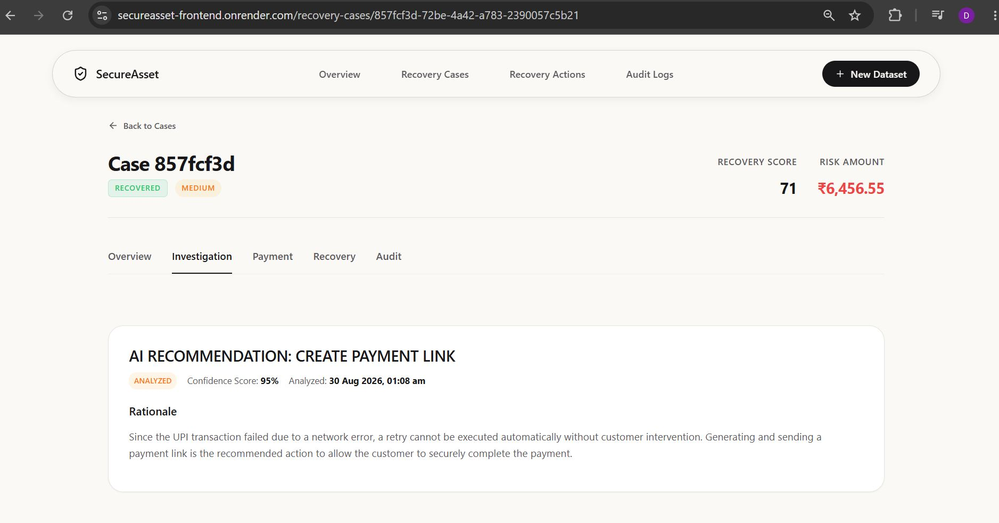
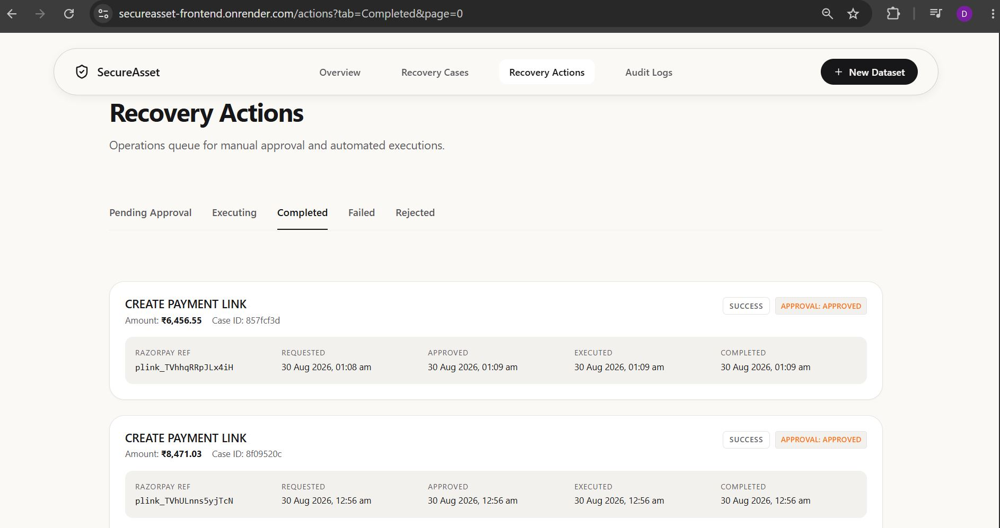
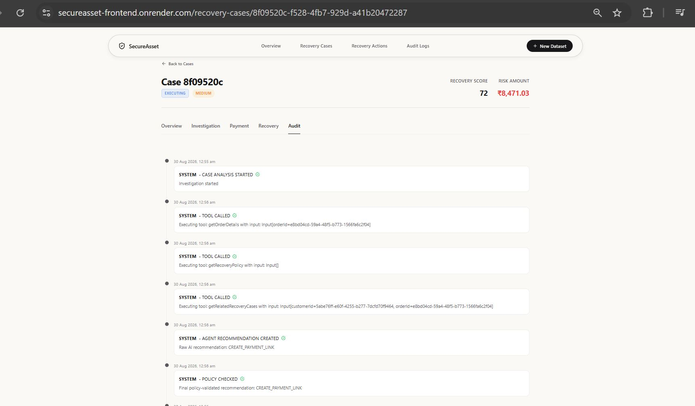

# SecureAsset

### AI-Driven Revenue Recovery with Human Governance
SecureAsset is an AI-assisted payment recovery platform that helps merchants investigate failed payments, evaluate recovery opportunities, generate explainable recovery recommendations, validate those recommendations against deterministic backend guardrails, route actions for merchant approval, execute approved recovery actions, and maintain a complete audit trail.

---

## Live Demo (The deployed services run on Render's free tier, so the first request may take some time while the service wakes from inactivity.)

**Frontend:**  
https://secureasset-frontend.onrender.com

**Backend:**  
https://secureasset-backend-ywjn.onrender.com

**Database:**  
PostgreSQL hosted on Supabase

**Payment Integration:**  
Razorpay Test Mode

- The deployed application uses synthetic demo data.  
- Razorpay execution is performed in Test Mode.

## The Problem
When a customer payment fails, a merchant can lose both the transaction and potentially the customer.
The failure may be caused by:
- network errors
- payment timeouts
- bank declines
- insufficient funds
- customer cancellation
- other transaction failures

The difficult part is not only detecting the failure.

A recovery system must determine:
1. Is the transaction actually worth recovering?
2. How urgent is the recovery opportunity?
3. What information should be investigated?
4. What recovery action is appropriate?
5. Can the AI recommendation be trusted?
6. Should a human approve the action?
7. Did the recovery action actually succeed?
8. Can the entire decision and execution process be audited?

SecureAsset addresses this complete lifecycle rather than stopping at payment-failure detection.


## What is SecureAsset?

SecureAsset is designed around a governed AI recovery lifecycle:
Failed Payment
-> Recovery Case
-> AI Investigation
-> AI Recommendation
-> Policy / Guardrails
-> Merchant Review
-> Recovery Action
-> Razorpay Execution
-> Webhook Confirmation
-> Outcome + Audit Trail

The AI does not directly execute financial actions.

Instead:
AI investigates and recommends  
-> Backend validates  
-> Merchant approves or rejects  
-> Backend executes  
-> External systems confirm the result  
-> Audit trail records what happened

## End-to-End Workflow


Detect → Understand → Govern → Recover → Prove


## Core Features

### Recovery Case Generation
Creates recovery cases from failed demo payments after deterministic eligibility and revenue-risk evaluation.

### AI Investigation
Uses a bounded AI agent to investigate a recovery case using registered backend tools.

### Explainable Recommendations
The AI returns:
- recommended action
- confidence
- reason
- evidence

### AI Failure Protection
Uses an ordered Gemini fallback chain. The first valid model response is used; if all configured models fail, the system safely escalates to merchant review.

### Policy & Guardrails
Deterministic backend rules validate or override AI recommendations before execution.

### Merchant Governance
Recovery actions are routed to a merchant approval/rejection workflow.

### Razorpay Integration
The `CREATE_PAYMENT_LINK` recovery path creates a real Razorpay Test Mode payment link and displays the returned `short_url`.

### Webhook Processing
Razorpay webhook events are verified and used to update payment, recovery-action, and case state.

### Audit Trail
Investigation, tool calls, recommendations, policy checks, approvals, execution, and outcomes are recorded as auditable events.

### Demo Dataset Isolation
Synthetic demo records are explicitly associated with a `DemoDataset`, preventing legacy records from appearing in the active demo.


## Architecture
```
React / TypeScript
        ↓
Spring Boot REST API
        ↓
┌──────────────┬──────────────┬
PostgreSQL     AI Agent       Razorpay
(Supabase)     + Gemini       Test API
                   ↓
                6 Tools
                   ↓
             Policy Layer
                   ↓
             Recovery Engine
                   ↓
               Audit Logs
```

## AI Investigation

The AI agent receives the structured Recovery Case context and can use six registered backend investigation tools.
The agent is bounded to a maximum of three tool invocations per model attempt.

### Investigation flow

Recovery Case
-> Initial Case Context
-> AI Agent
-> Relevant Tool Calls
-> Tool Results
-> Evidence
-> Gemini
-> Structured Recommendation
-> Policy Validation

| Tool -> Purpose |

- `getCustomerPaymentHistory` -> Summarizes customer payment behavior
- `getCustomerRecoveryProfile` -> Builds a derived recovery profile
- `getOrderDetails` -> Retrieves bounded order/payment-attempt information
- `getRelatedRecoveryCases` -> Retrieves previous recovery cases and outcomes
- `getRazorpayPaymentStatus` -> Fetches payment status from Razorpay
- `getRecoveryPolicy` -> Provides the current recovery policy and limits

### Model Fallback

SecureAsset uses an ordered fallback chain:
-> Gemini 3.6 Flash
-> Gemini 3.5 Flash
-> Gemini 3.5 Flash Lite
-> Gemini 2.5 Flash
-> Escalate to Merchant

Only failures cause the system to move to the next model.
The first valid recommendation wins.

## Policy & Guardrails
SecureAsset does not treat an AI recommendation as an executable financial instruction.
Deterministic backend rules exist before and after AI investigation.

### Before AI
- ineligible case → `NO_ACTION`
- already captured payment → `NO_ACTION`
- maximum recovery attempts reached → `ESCALATE_TO_MERCHANT`

### After AI
- risk amount above ₹10,000 → `ESCALATE_TO_MERCHANT`
- existing `PENDING` recovery action → `ESCALATE_TO_MERCHANT`
- existing `EXECUTING` recovery action → `ESCALATE_TO_MERCHANT`

The current MVP uses the recovery-action enum for recognized action types rather than a complex dynamic policy engine.


## Recovery Actions

Supported recovery action types:
- `CREATE_PAYMENT_LINK`
- `RETRY_PAYMENT`
- `SEND_RECOVERY_REMINDER`
- `NO_ACTION`
- `ESCALATE`

All actionable decisions enter the merchant recovery workflow.

### Current external execution path
The fully implemented external recovery path demonstrated in the deployed system is:
`CREATE_PAYMENT_LINK`
Other action types exist in the recovery-action domain and can participate in the merchant workflow, but should not be described as having an equivalent external execution integration unless such an execution path exists.

## Razorpay Payment Flow
```text
Merchant Approval
        ↓
Recovery Action
        ↓
EXECUTING
        ↓
Razorpay Test API
        ↓
Payment Link + short_url
        ↓
SecureAsset stores result
        ↓
Payment URL displayed
        ↓
Customer completes payment
        ↓
Razorpay Webhook
        ↓
Backend verification
        ↓
Payment / Action / Case updated
        ↓
Final Outcome
        ↓
Audit Trail
```

## Auditability
The audit trail answers:
- What did the agent see?
- What tools did it use?
- What recommendation did it make?
- What policy was applied?
- What did the merchant decide?
- What happened during execution?
- What was the final outcome?

Typical events include:
```markdown
```text
CASE_ANALYSIS_STARTED
TOOL_CALLED
TOOL_FAILED
AGENT_RECOMMENDATION_CREATED
POLICY_CHECKED
ACTION_APPROVAL_REQUESTED
ACTION_APPROVED
RAZORPAY_REQUEST
Execution / Result
Webhook / Payment Outcome
```

```markdown
## Screenshots

### Overview


### Recovery Case


### AI Investigation


### Recovery Actions


### Audit Trail

```

## Challenges & Solutions
### 1. Gemini quota failures
Gemini quota errors caused investigations to fall back to `ESCALATE_TO_MERCHANT`.

**Solution:**  
Implemented an ordered multi-model fallback chain. The first valid model response is used; only when all configured models fail does the existing human-review fallback activate.

### 2. Recovery action stopped at APPROVED
An approved `CREATE_PAYMENT_LINK` action was initially persisted as `APPROVED` without triggering execution.

**Solution:**  
Connected the approval flow to `executeAction()`, connected execution to Razorpay, persisted the returned `short_url`, and exposed the result in the recovery-action UI.

### 3. Legacy data polluted the demo
The original database contained approximately 10,000 customers, 20,000 orders, and 30,000 payments, causing old records to appear in the application.

**Solution:**  
Introduced explicit `DemoDataset` ownership and dataset-scoped queries, then cleaned the legacy development dataset once the isolation model was verified.


## Deployment
### Frontend
Render Static Site
### Backend
Render Web Service
### Database
Supabase PostgreSQL
### External Services
- Google Gemini
- Razorpay Test Mode
### Configuration
Sensitive credentials are provided through environment variables and are not committed to the repository.
## Project Outcome
SecureAsset demonstrates a complete governed AI recovery loop:
**Investigate → Reason → Validate → Review → Approve → Execute → Recover → Audit**
The core idea is not simply using an LLM to generate an answer.

SecureAsset separates:
**Financial Facts**
→ orders, payments, transaction state
from

**AI Decisions**
→ investigation, recommendation, reasoning
and places:

**Deterministic Governance**
→ eligibility, policy, guardrails
and

**Human Governance**
→ merchant approval / rejection
between AI reasoning and financial execution.
The result is an end-to-end recovery workflow that can investigate failed payments, recommend recovery actions, safely execute the implemented Razorpay recovery path, receive the external payment outcome, and preserve an auditable record of the entire lifecycle.

## Tech Stack

**Frontend**
- React
- TypeScript
- Vite

**Backend**
- Java 21
- Spring Boot
- Spring Data JPA
- Spring AI

**Database**
- PostgreSQL
- Supabase

**AI**
- Google Gemini

**Payments**
- Razorpay Test Mode

**Deployment**
- Render
- Supabase
